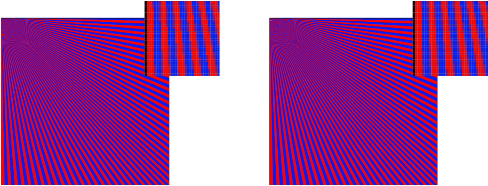
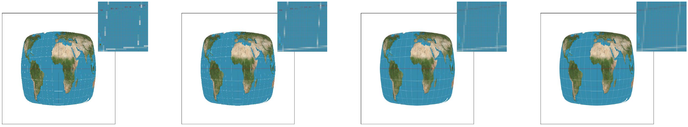
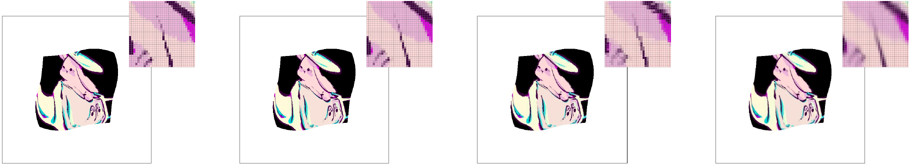

# CS 284 HW1 - Shiran Yuan

[GitHub Repository](https://github.com/cal-cs184-student/sp25-hw1-drop-table-teams/)

## Overview

In this assignment I implemented a rasterizer for triangles in SVG format, including single-colored ones, ones with barycentric-interpolated colors, and textured ones. The implementation contains multiple different methods for antialiasing. My main takeaway from this assignment is that I will never take rasterization for granted again... it is straightforward but actually contains many engineering-wise details that have to be taken care of, and there are many ways to implement the same functionality but with widely different outcomes (in terms of performace and overhead).

## Task 1

My rasterization algorithm was loosely inspired by the Incremental Triangle Traversal algorithm diagram in the lecture (I did not look it up because I want to figure things out myself). For the first step, we find the vertex with the smallest $y$ value, whose coordinates are $(x^\*,y^\*)$. There are thus three types of triangles, based on the relation between $x^\*$ versus all vertices' $x$ coordinates (smallest, largest, neither), which we dub cases 1, 2, and 3. In case 1, we initialize the value of $y$ to be $\lfloor y^\*\rfloor+.5$; in case 2, we initialize it as $\lfloor y^*\rfloor-.5$; and in case 3, we run algorithms for cases 1 and 2 separately as if we are rendering two separate triangles (to wit, we split the triangle in question with the line $y=y^\*$, turning it into one each of case-1 and case-2 triangles).

We now elaborate on the case 1 algorithm (case 2 is trivially symmetric). We render row-by-row (we increment $y$ at the end of each row iteration) and from left to right (we keep incrementing $x$). We first initialize a "minimal $x$" as $\lfloor x^\*\rfloor+.5$, which will record the $x$ coordinate of the first sampling point of the row that is in the triangle (_i.e._ track the leftmost edge). This is implemented by incrementing $x$ until it is within the triangle (there's a catch to be elaborated), and then recording that value of $x$ as the minimal $x$ (which is never decreased). The rest is obvious: we fill each encountered pixel until the first sample that does not lie in the triangle, after which we proceed to the next line.

Here's the catch: if the triangle is thin enough, in some rows no sampling points will lie inside the triangle, and we will be unable to find a minimal $x$ for that row. Hence, we dictate in our loop that if $x$ exceeds the bounding box while attempting to find a minimal $x$, we will proceed to the next row and keep the original value of minimal $x$. 

My algorithm is much better than one that checks the entire bounding box because it never traverses beyond the bounding box, and gives both starting and ending conditions during the traversal of each row. Fig. 1 shows its rendering of _basic test 4_.

    
    
<em>Figure 1</em>. Jaggies! Grrrr...

_Extra credit_: My optimizations are as aforementioned, and performance comparisons from rendering _basic test_ images are detailed in Tab. 1.

    <table>
        <caption><em>Table 1</em>. My method compared with the baseline of traversing the entire bounding box. Timed in microseconds.</caption>
        <thead>
            <tr>
                <th>Image</th>
                <th>3</th>
                <th>4</th>
                <th>5</th>
                <th>6</th>
            </tr>
        </thead>
        <tbody>
            <tr>
                <td>Mine</td>
                <td>2996.6</td>
                <td>90.6</td>
                <td>260.8</td>
                <td>238.0</td>
            </tr>
            <tr>
                <td>Baseline</td>
                <td>4664.1</td>
                <td>157.7</td>
                <td>465.4</td>
                <td>373.0</td>
            </tr>
            <tr>
                <td>Speedup</td>
                <td>35.8%</td>
                <td>42.5%</td>
                <td>44.0%</td>
                <td>36.2%</td>
            </tr>
        </tbody>
    </table>

## Task 2

For supersampling, I modified the pipeline by letting the triangle rasterization method update the sampling buffer and averaging those to the framebuffer. Specifically, we modify the algorithm in Task 1 by reducing initializations and step sizes proportional to the square root of the sampling rate. Then, for each pixel in the framebuffer, we average blocks of corresponding sampled subpixels in the sample buffer. Supersampling is useful because it increases the sampling rate, thus alleviating aliasing by making the sampling rate exceed Nyquist rates of more signals. Results are showcased in Fig. 2.

    
    
<em>Figure 2</em>. The effect of supersampling. From left to right the sampling rates are respectively 1, 4, 9, and 16.

It is possible to achieve identical results without requiring extra memory by traversing the scene pixel by pixel (such that sampled subpixels are directly averaged). However, this would require traversing the entire bounding box, which brings a speed overhead.

_Extra credit_: I also implemented low-discrepancy sampling using the 2-3 Halton sequence. In order to demonstrate the effect, inspired by image _hardcore 01 degenerate square_ (which is black and blue), I created alternating red and blue radially spread triangles with severe aliasing near the origin. This way, the handling of color mixture near smoothed jaggies will demonstrate differences between the two methods, as shown in Fig. 3.

    
    
<em>Figure 3</em>. On the left is the grid-based method and on the right is Halton sampling. The latter separates red and blue better in the borderline pixels, creating a more transitional appearance, while in the former most borderline pixels are uniformly violet. Here we use a sampling rate of 4.

## Task 3

I chose Megan's pose from my favorite xkcd comic: 162 Angular Momentum! See Fig. 4. I simply changed the coordinates of the triangles and the associated transformations in the svg according to calculations of the limb and body angles (slightly adjusted for visual appeal).

    
    
<em>Figure 4</em>. WITH YOU.

_Extra Credit_: I made the E key "rotate counterclockwise by 5 degrees" and the R key clockwise. I did it by adding a transformation in to the svg-to-ndc matrix of the _DrawRend_ pipeline. The transformation consists of a translation such that the center of the svg coincides with the origin, a rotation, and a translation back. Fig. 5 shows the rotated robot.

    
    
<em>Figure 5</em>. Rotation of the svg.

## Task 4

Barycentric coordinates can be used to blend values (such as colors) of vertices of a triangle (_e.g._, the triangle with RGB vertices shown in Fig. 6) proportionally to the distance between the point of interest and the respective edges. Specifically, given a vertex A, the edge across from it BC, and the point of interest P, the barycentric coordinate associated with A is the ratio between the distance from P to BC and the distance from A to BC. The coordinates can then be used as weight coefficients for the vertex values.

    
    
<em>Figure 6</em>. The color triangle and the color wheel.

## Task 5

Pixel sampling involves using barycentric interpolation to find the uv-coordinates of each of the pixels within the triangle, and then proceeding to sample the color value at that uv-coordinate within the texture space. Nearest pixel sampling is where the sampling-within-the-texture-space step is carried out by choosing the nearest texel, and bilinear interpolation sampling is where the weighted average of the four nearest texels are taken, with the weights decided by the horizontal/vertical distance between the target point and the four edges of the surrounding sampling grid of texels.

Fig. 7 shows experimentation results on the image _texmap test 1_. As shown, bilinear sampling leads to better antialiasing than nearest sampling (at the cost of efficiency), but the discrepancy becomes less obvious when supersampling is applied. The difference will be more pronounced when the texture is significantly magnified (the screen space sampling frequency is much lower than the texture sampling frequency), because with lower frequency effects of antialiasing would be more pronounced without interpolation.

    
    
<em>Figure 7</em>. From left to right: nearest w/ sampling rate 1, bilinear w/ rate 1, nearest w/ rate 16, and bilinear w/ rate 16.

## Task 6

Level sampling is accomplished by selecting the appropriate mipmap level based on the ratio of a texel area versus the corresponding pixel area. If the ratio is large, a higher level (with lower resolution) should be used, and vice versa. This can help with antialiasing. My implementation involves calculating the ratio between a unit of pixel x/y length in screen space versus a unit of texel u/v length in texture space and taking the log of the maximum dilation among a unit of either x or y as an indicator of which mipmapping level to use. Nearest level sampling rounds that level to the nearest integer, while bilinear sampling conducts lerp between the floor and ceiling of that level. Comparisons between different methods of pixel and texture sampling are showcased in Fig. 8.

    
    
<em>Figure 8</em>. From left to right: nearest+zero, bilinear+zero, nearest+nearest, bilinear+nearest.

Among the explored antialiasing methods, supersampling has very high speed and memory overhead, but yields good quality for simple patterns like lines and triangles. Meanwhile, pixel sampling methods are more efficient, have nearly no memory overhead, and are more effective for textured images. Level sampling methods in mipmapping handle antialiasing at the cost of blurring the image (similar to low-pass prefiltering) and have a slight memory overhead (one-third of the original texture), but seem to be the most effective at antialiasing textured images.

# Competition Project: Make It Low-Poly!
I've always believed that the means to art is more important than art itself, so for this competition I created a tool that allows the conversion of images to SVGs in the style of low-poly art! Allow me to elaborate...

The adjective "low-poly" refers to 3D meshes with a small number of polygons, and are often used as symbols for computer graphics and tessellation. As they are beautiful, some 2D artworks also aim to recreate the geometric style of low-poly meshes.

So here is the pipeline I assembled:
1. Construct a canny map of the image. This is a transformation often used in computer vision that detects regions with high-frequency color changes.
2. Sample "edge points" from nonzero pixels of the canny map, and sample (a much fewer number of) points across the entire image. Those two sets combined will form the vertices.
3. Then perform Delaunay triangulation on the set of vertices.

The Python source code is available in the "src" folder of the repository. My entry to the competition is as in Fig. 9.

    
    
<em>Figure 9</em>. Life is beautiful : )

