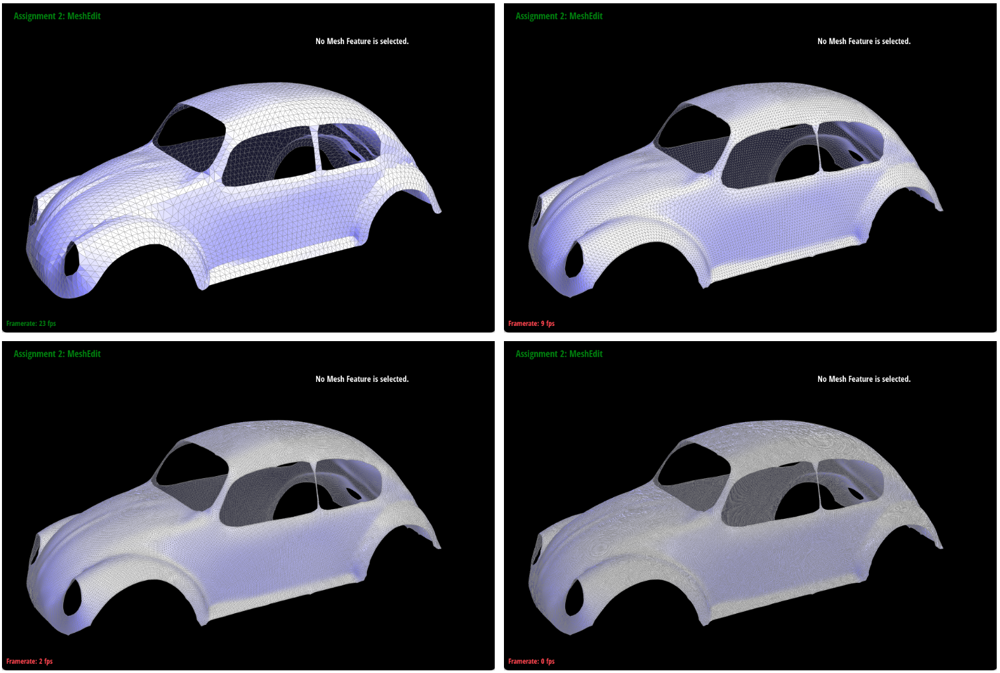



# CS 284 HW2 - Shiran Yuan

[GitHub Repository](https://github.com/cal-cs184-student/sp25-hw2-a-dui-dui-team/)

[Homepage](https://cal-cs184-student.github.io/hw-webpages-drop-table-teams-1/)

## Overview

In this assignment I implemented 1. a tool for drawing Bezier curves and surfaces and 2. two triangular mesh subdivision algorithms (4-1 subdivision and $\sqrt3$ subdivision) for mesh upsampling. During the homework I often drew out and marked all edges, vertices, faces, and half-edges involved to have an intuitive view of their relationship. I met no significant problems during the homework.

## Task 1

De Casteljau’s algorithm is a method of forming Bezier curves by repeatedly applying linear interpolation to conditioning points. Specifically, during each step, given an interpolation ratio $t$, each pair of the original $n$ conditioning points are linear-interpolated to form $n-1$ conditioning points. The process then continues by repeatedly applying such steps until only one point is left, in which case this point corresponds to the value $t$ on the parameterized Bezier curve. 

My implementation simply applies linear interpolation to neighboring pairs of input points and outputs the results. A total of $n-1$ steps are needed to arrive at a final point for each value of $t$. Fig. 1 visualizes the steps through de Casteljau's algorithm to arrive at a Bezier curve, and Fig. 2 displays another curve with a different chosen value of $t$.

    
    
<em>Figure 1</em>. Visualization of steps for de Casteljau's algorithm.

    
    
<em>Figure 2</em>. Altering the curve and $t$.

## Task 2

De Casteljau's algorithm can be applied to Bezier surfaces as well by first finding the Bezier curves represented by each row of conditioning points. Then, for each value of $t$, the corresponding conditioning points are the points parameterized by $t$ on each of the row curves, forming a Bezier curve for each $t$, thus collectively forming a Bezier surface. The Utah teapot as a Bezier surface is shown in Fig. 3.

    
    
<em>Figure 3</em>. The Utah teapot as a Bezier surface.

## Task 3

Using the half-edge data structure one can easily iterate through neighboring edges (and thus triangles) of a vertex. Given a triangle with vertices $a,b,c\in\mathbb R^3$ we can then calculate its area as 

$$A=||((b_2-a_2)(c_3-a_3)-(b_3-a_3)(c_2-a_2),(b_1-a_1)(c_3-a_3)-(b_3-a_3)(c_1-a_1),(b_1-a_1)(c_2-a_2)-(b_2-a_2)(c_1-a_1))||_2$$ 

and proceed to weight surface normals by areas. A juxtaposition is shown in Fig. 4.

    
    
<em>Figure 4</em>. Comparison between flat and Phong shading of the Utah teapot triangular mesh.

## Task 4

During the edge flip operation I identified the 4 vertices, 5 edges, 10 half-edges, and 2 faces associated with the two adjacent triangles. I then re-assigned the pointers accordingly. I found drawing out all elements in a diagram helpful. Results are shown in Fig. 5.

    
    
<em>Figure 5</em>. The Utah teapot mesh after some edge flips.

## Task 5

Similar to the edge flip operation I identified elements associated with the adjacent triangles. After connecting the new edges appropriately I delete the original edge, half-edges, and face. Results are shown in Fig. 6.

    
    
<em>Figure 6</em>. The Utah teapot mesh with edge splits and flips applied.

**Extra Credit**: I implemented support for boundary edges. The new vertex is added directly as the midpoint of the edge's endpoints without taking the two opposing triangle vertices into account. Results are shown in Fig. 7.

    
    
<em>Figure 7</em>. The Beetle mesh with boundary edge splits.

## Task 6

I made an array of all edges in the mesh and split each one in order. I then flipped all edges that connect a new vertex to an old vertex and does not come from a split edge. After subdivision, sharp edges are corners are smoothed out (as shown in Fig. 8) but can be preserved if more edges are created on some faces during mesh preprocessing (_e.g._, as in Fig. 9). 

    
    
<em>Figure 8</em>. Sharp edges are smoothed out during subdivision.

    
    
<em>Figure 9</em>. Preprocessing can partially preserve sharp edges.

In the cube scene, the asymmetry after subdivision (Fig. 10) can be attributed to the initial vertices with degree 3 being less restrained by neighboring vertices during position updates. This effect can be reduced by pre-splitting the diagonal edges on each of the cube's face (Fig. 11).

    
    
<em>Figure 10</em>. Asymmetry when subdividing a cube.

    
    
<em>Figure 11</em>. Pre-splitting to reduce asymmetry.

**Extra Credit 1**: I implemented support for boundaries. Results visualized in Fig. 12.

    
    
<em>Figure 12</em>. Splitting a mesh with boundaries.

**Extra Credit 2**: I implemented $\sqrt3$-subdivision, where we subdivide triangles by connecting each of the old vertices to a new vertex at the center of the triangle and flip all old edges. I also altered the GUI such that pressing the key "P" uses $\sqrt3$-subdivision. Results visualized in Fig. 13.

    
    
<em>Figure 13</em>. Results from $\sqrt3$-subdivision.

