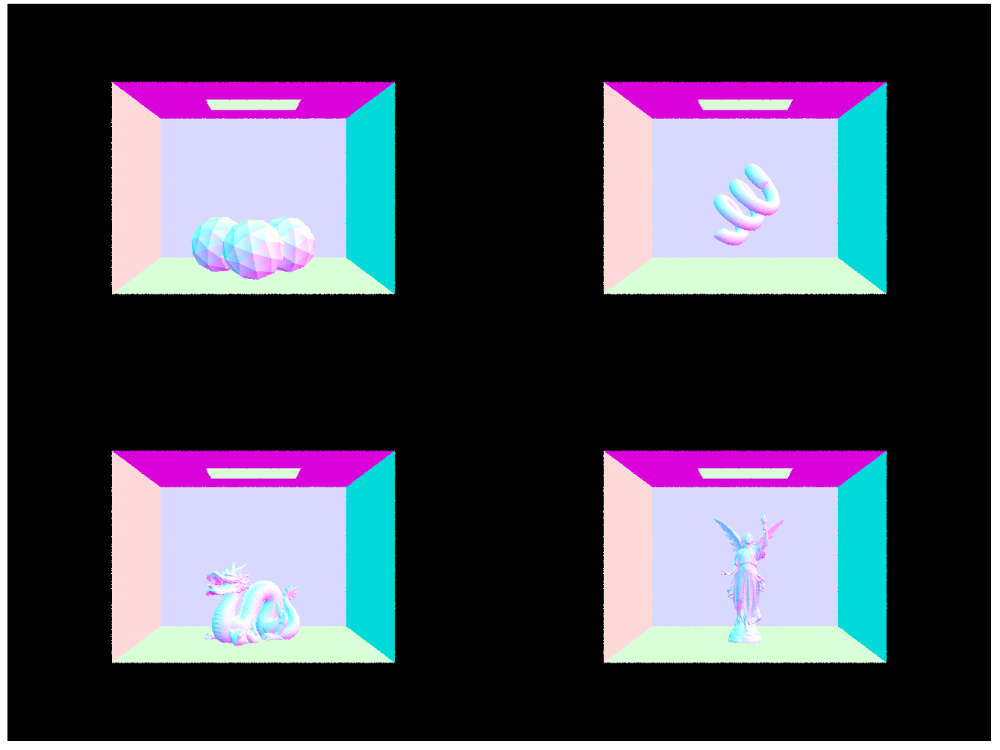



# CS 284 HW3 - Shiran Yuan

[GitHub Repository](https://github.com/cal-cs184-student/sp25-hw3-all-your-team-are-belong-to-us/)

[Homepage](https://cal-cs184-student.github.io/hw-webpages-drop-table-teams-1/)

## Overview

In this project I implemented a raytracer that incorporates techniques including basic raycasting, BVH optimization, uniform hemisphere sampling, importance sampling, global illumination, Russian Roulette, adaptive sampling, Halton pseudorandom sampling, and bilateral filtering.

## Part 1

The rendering pipeline first creates rays corresponding to each pixel by randomly sampling points within pixels of interest and casting rays through them. This step of the process also involves transformations between different coordinate spaces, as points are sampled in camera space, scaled into normalized camera space, and then the rays are transformed into world space. Then, for the primitive intersection part, all primitives are iterated through to see which ones intersect with the ray. When an intersection is found, the ray is also cut short such that the eventual intersection found is always the one closest to the camera. 

For ray-triangle intersection I implemented the Möller-Trumbore Algorithm, which finds the $t$ of the ray-plane intersection and the barycentric coordinates of the intersection point using a series of dot and cross products. Specifically, given triangle vertices $p_0,p_1,p_2$ and the ray $o+td$, we have triangle edges $e_1=p_1-p_0$, $e_2=p_2-p_0$, and helper vectors $s=o-p_0$, $s_1=d\times e_2$, $s_2=s\times e_1$. Then at the intersection, we have $t=\frac{s_2\cdot e_2}{s_1\cdot e_1}$, and barycentric coordinates $b_0=\frac{s_1\cdot s}{s_1\cdot e_1}$, $b_1=\frac{s_2\cdot d}{s_1\cdot e_1}$, $b_2=1-b_0-b_1$. Fig. 1 shows some results under normal rendering.

	
	
<em>Figure 1</em>. Results under normal rendering.

## Part 2

I chose the median heuristic for splitting nodes. Specifically, for each node in the BVH I choose the largest dimension of its bounding box as the splitting axis. I then list the centroids of all primitives, sort them, and split them according to the median coordinate along the splitting axis. Results are displayed in Tab. 1 and Fig. 2. 

	
	
<em>Figure 2</em>. Objects under normal rendering with BVH optimization.

    <table>
        <caption><em>Table 1</em>. Rendering time in seconds.</caption>
        <thead>
            <tr>
                <th></th>
                <th>Beast</th>
                <th>Beetle</th>
                <th>Cow</th>
                <th>Peter</th>
				<th>Planck</th>
				<th>Teapot</th>
            </tr>
        </thead>
        <tbody>
            <tr>
				<td>Vanilla</td>
                <td>46.7115</td>
                <td>3.2075</td>
                <td>2.3780</td>
                <td>19.8409</td>
				<td>30.5662</td>
                <td>1.1475</td>
            </tr>
            <tr>
                <td>Optimized</td>
                <td>0.0539</td>
                <td>0.0355</td>
                <td>0.0551</td>
                <td>0.0451</td>
				<td>0.0684</td>
                <td>0.0524</td>
            </tr>
        </tbody>
    </table>

It seems that the result was so efficient the bottleneck was not rendering but the hardware's fluctuating overheads (the rendering time is basically independent of the scene's complexity). This shows that BVHs have decreased the rendering time complexity substantially.

## Part 3

In uniform hemisphere sampling, we randomly sample shadow rays from the hemisphere on the primitive that the camera ray intersects, and then transform it to world coordinates to form a shadow ray; we then find the first intersection of the shadow ray with a primitive and use the zero-bounce radiance of that primitive as the radiance to plug into the Monte Carlo formula. In importance sampling, we sample light rays from points on the light sources to the camera ray's intersection point, and use the light source's radiance if the light ray does not pass through primitives in between. In both cases the Monte Carlo estimator used is
$$
\frac1N\sum\limits_{j=1}^N\frac{f_jL_j}{\textrm{pdf}_j}\frac{|d\cdot n|}{|d||n|},
$$
where $f_j$ is the BSDF value, $L_j$ is the sampled radiance, $\textrm{pdf}_j$ is the PDF value, and the second fraction is the cosine term, where $d_{\textrm{shadow}}$ is the light/shadow ray's direction vector, and $n$ is the normal vector of the intersection point. Juxtapositions are shown in Fig. 3.

	
	
<em>Figure 3</em>. Results of direct illumination using two different sampling methods.

Fig. 4 shows results with changing the number of light rays. As shown, sampling fewer light rays results in soft shadows being very noisy and containing completely dark pixels, while sampling more rays reduces the variance and gives shadows the "soft" appearance.

	
	
<em>Figure 4</em>. Importance sampling with different numbers of light rays (1, 4, 16, 64 respectively, with 1 sample per pixel).

As shown, uniform hemisphere sampling is more noisy because most of the light rays do not intersect with lights, effectively resulting in a fewer number of sampled light rays. Furthermore, it is unable to handle point lights. Meanwhile, importance sampling ensures every sampled light ray is connected to a light source (unless it is blocked by a primitive), and hence is more efficient and less noisy.

## Part 4

My implementation of the indirect lighting function calls the important-sampling single-bounce function as the base case (for ray depth 1) and then evaluates indirect lighting recursively using Monte Carlo estimation. Specifically, if the function passes the Russian Roulette coin flip (otherwise the base case is directly returned), we will hemisphere-sample a random ray, which hits a new intersection, and then call indirect lighting with one less depth on that intersection. Results are shown in Figs. 5-9.

	
	
<em>Figure 5</em>. Objects rendered with global illumination.

	
	
<em>Figure 6</em>. Direct and indirect illumination.

	
	
<em>Figure 7</em>. Global illumination with different numbers of bounces.

	
	
<em>Figure 8</em>. Results under Russian Roulette.

	
	
<em>Figure 9</em>. Using different numbers of samples per pixel.

In Fig 7, one can see that the second bounce lights up the ceiling, parts under the rabbit, and so on, therefore enabling softer shadows, color bleeding, and so on. The third bounce puts more emphasis on the background, especially the relatively dark edges and corners.

## Part 5

Adaptive sampling allows for sampling a pixel for as many times as needed to reach a given confidence. In our implementation, we re-sample a pixel and record the mean $\mu$ and standard deviation $\sigma$ so far. Given tolerance $\alpha$, we stop the pixel sampling when $1.96\frac{\sigma}{\sqrt n}\le\alpha\mu$ (the relative error is less than $\alpha$ with 95$\%$ confidence). Results are shown in Fig. 10.

	
	
<em>Figure 10</em>. With adaptive sampling.

## Part 6

__Challenge Level 1__: I implemented Halton sampling, a method of pseudorandom sampling. I used the 2-3 Halton sequence to sample points from grids. Results are shown in Fig. 11. As shown, Halton sampling gives results that are marginally less noisy and better antialiased, although the difference is largely negligible for most purposes.

	
	
<em>Figure 11</em>. Results of Halton sampling.

__Challenge Level 2__: I implemented bilateral filtering, which is a variant on gaussian blur that preserves edges and sharpness by multiplying the gaussian filter by the pixel similarity of the points in the kernel with respect to the center pixel. Results are shown in Fig. 12.

	
	
<em>Figure 12</em>. Results of bilateral blur. Scenes here are rendered with 64 samples per pixel and 1 light ray per intersection.

